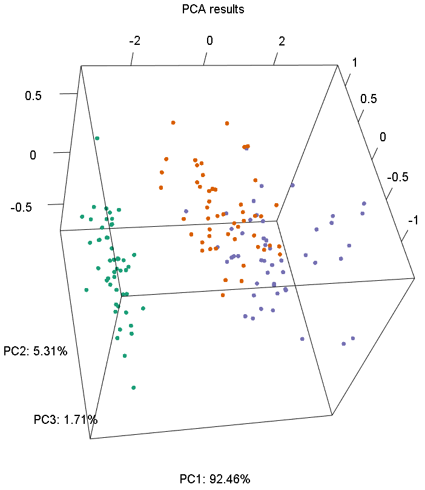

```{r setup, echo=FALSE,warning=FALSE,message=FALSE}

library(pca.utils)
```

## The pca.utils package

This package aims at making standard PCA related tasks easier, requiring fewer lines of code.
At this point it provides two main functions:

* plot_pca: which quickly plots 2D or 3D PCA results.

* project_pca: which projects new data in an existing PCA space.

### plot_pca() example

Here we will quickly create 2D and 3D PCA plots of the iris data set, using 1 line of code.
```{r plot_pca, eval=FALSE}

data(iris)

# 2D PCA
plot_pca(x=iris[1:4],col=iris$Species)

# 3D PCA
plot_pca(x=iris[1:4],npcs=3,col=iris$Species)
```




### project_pca() example

We will use 100 random data points of the iris data set to compute the PCA space and then
project the remaining new 50 data points in the existing PCA space, as follows:

```{r project_pca, eval=FALSE}

set.seed(1)
data(iris)

#randomly select 100 data points from the iris data set
#to perform PCA
ix=rep(FALSE,nrow(iris))
ix[sample(nrow(iris),100)]=TRUE

# perform PCA
pc=stats::prcomp(as.matrix(iris[ix,1:4]))

# plot the PCA
plot_pca(pc,col=iris$Species[ix])

# project the remaining 50 data points (given by !ix) in the existing PCA space
Xpc=project_pca(as.matrix(iris[!ix,1:4]),pc)

#plot the new data points in the existing plot
points(Xpc[,1],Xpc[,2])
```


## Installation instructions

Make sure you have the devtools package installed,
then you can use devtools::install_github, as follows:

```{r installation_instructions, eval=FALSE}
devtools::install_github('nchlis/pca.utils')
```
